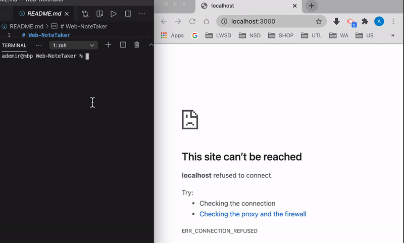

# Note Taker


## Description
This is a node application that can be used to write, save, and delete notes. <br /> 
This application  uses  express backend to save and retrieve note  from a JSON file.
<br /> 


<br /> 
<br /> 

You can check the working application  [here](https://ademir-note-taker.herokuapp.com/) 




<br /> 

## User Story
```
AS A user, I want to be able to write and save notes
I WANT to be able to delete notes I've written before
SO THAT I can organize my thoughts and keep track of tasks I need to complete
```

## Acceptance Criteria
```
Application should allow users to create and save notes.
Application should allow users to view previously saved notes.
Application should allow users to delete previously saved notes.
```
## Installation
The following  dependencies must be installed to run the application: <br /> 
dependencies: express


## Usage
​This application is used for taking notes and save them on the server side for later retrieval.

## License
This project is license under the MIT license.

## Contributing
​Contributors: Ali Demir


<br /> 

My GitHub username: [alidemirbay](https://github.com/alidemirbay)
<br />
You can ask your questions at: alidemirbay@gmail.com